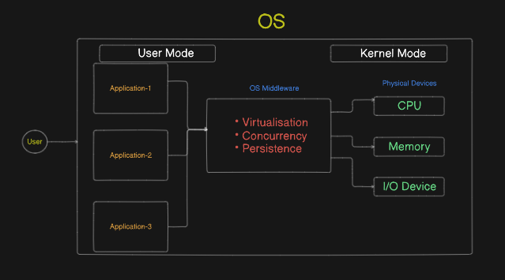

#  **Operating System** 

##  Definition:

- Operating System is a **system software** which act as **middleware** between Application Software(Software to which User Interacts with) and the Hardware(The physical devices that perform the computation)
- The three main functions **(Causality)** of OS are:
  - **Virtualisation**
  - **Concurrency**
  - **Persistence**
- The above three things are the main function (Causality) of all the functions OS(Effects) perform:
  - Resource Mangement
  - File Management
  - Process Scheduling and Execution
  - Device Management
  - Memory management
  - Security and Protection

