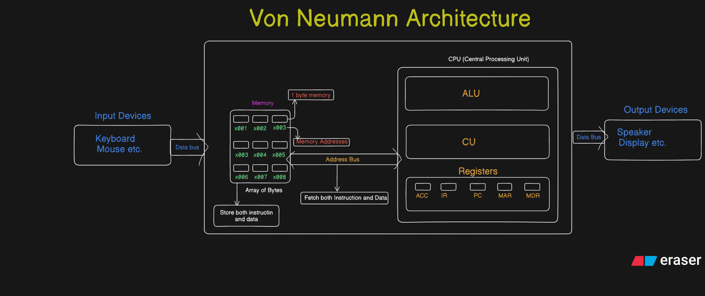
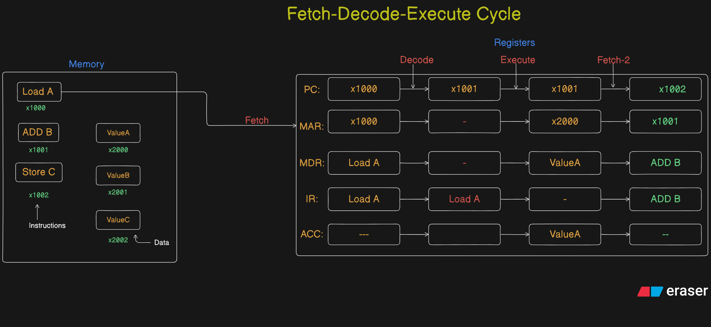

# <span style="color:#a7c957"> Von Neumann Architecture of Computer </span>



### <span style="color:#ffb703"> Details About Von Neumann Architecure</span>

The Von Neuman architecture is a Computer Architecture where <b> data and instruction are stored in the same memory </b>

- It was introduced in the 1945 paper: **"First Draft of a Report on the EDVAC"** by **John von Neumann**.

---

## 🧱 **Main Components of Von Neumann Architecture**

### 1. **Memory Unit**

- Stores both **data** and **instructions** (program).
- Memory is **addressable**, meaning each location has a unique address (e.g., 0x001, 0x002…).
- Uses **Random Access Memory (RAM)** in modern systems.

### 2. **Central Processing Unit (CPU)**

The **brain** of the system. It has 3 main subcomponents:

#### a) **Arithmetic Logic Unit (ALU)**

- Performs all arithmetic operations (add, subtract, multiply, divide).
- Performs logical operations (AND, OR, NOT, comparisons).

#### b) **Control Unit (CU)**

- Directs the operation of the processor.
- It **fetches instructions**, **decodes them**, and **executes** them using the ALU and memory.
- Sends **control signals** to other components.

#### c) **Registers**

- Small high-speed memory locations inside the CPU.
- Temporary storage for instructions and data during execution.
- Common Registers:

  - **Program Counter (PC):** Holds address of the next instruction.
  - **Instruction Register (IR):** Holds the current instruction.
  - **Accumulator (ACC):** Stores intermediate results from the ALU.
  - **Memory Address Register (MAR):** Holds address for memory access. _(Jo Memory se Instruction Fetch krna wo store hoti hai yaha)_
  - **Memory Data Register (MDR):** Holds data read from or to be written to memory. _(Data jo MAR se read kra hai ya jo MAR mai stored Memory Addres main write krna hai)_

### 3. **Input/Output Devices**

- **Input Devices:** Keyboard, mouse, sensors.
- **Output Devices:** Monitor, printer, actuators.
- Interfaces with the memory and CPU via system bus.

### 4. **System Bus**

A communication pathway:

- **Data Bus:** Carries data between memory, CPU, and I/O.
- **Address Bus:** Carries memory addresses from CPU to memory._(Fetch Both Instruction and Data from Memory)_
- **Control Bus:** Carries control signals from the control unit to other components.

---

## ⚙️ **How Does Von Neumann Architecture Work?**

### ➤ The **Instruction Cycle** (Fetch-Decode-Execute)

---

### ✅ **1. Fetch**

- The **Program Counter (PC)** holds the address of the next instruction._(Points to the Memory Address jo agle Fetch Cycle mai fetch krna hai)_
  - _Increments after each fetch cycle gets executed -> Har fetch cycle ke baad agle Memory Address jiss se data fetch krna hai use point krta hai_
- This address is sent to **MAR**.
- Memory sends the instruction at this address to the **MDR**.
- The instruction is then moved to the **Instruction Register (IR)**.
- **PC is incremented** to point to the next instruction.

---

### ✅ **2. Decode**

- The **Control Unit** decodes the instruction in the **IR**.
- Determines the operation (e.g., add, load, store).
- Identifies which registers or memory locations are involved.

---

### ✅ **3. Execute**

- The **ALU** performs the required computation or logic.
- If the operation involves data from memory, appropriate addresses are used via MAR/MDR.
- The result is stored in a **register** (usually the **ACC**).

---

### Example: Instruction to Add Two Numbers

Let’s say:

- Instruction at memory location 1000: `LOAD A` (loads value from address A into ACC)
- Instruction at 1001: `ADD B` (adds value from address B to ACC)
- Instruction at 1002: `STORE C` (stores result in address C)

**Cycle Breakdown:**

| Step    | PC   | MAR  | MDR      | IR       | ACC    | Action                       |
| ------- | ---- | ---- | -------- | -------- | ------ | ---------------------------- |
| Fetch   | 1000 | 1000 | `LOAD A` | `LOAD A` |        | Load instruction from memory |
| Decode  |      |      |          | `LOAD A` |        | CU decodes instruction       |
| Execute |      | A    | ValueA   |          | ValueA | Load ValueA to ACC           |
| ...     | ...  | ...  | ...      | ...      | ...    | Continue for `ADD B`, etc.   |

---

## 🎯 Key Concepts First

- **PC (Program Counter):** Always points to the **next instruction** to be executed.
- **MAR (Memory Address Register):** Temporarily holds the **memory address** of either:

  - The instruction to fetch (during **fetch** stage), or
  - The data to read/write (during **execute** stage).

---

## 👣 Step-by-Step Breakdown

### Suppose You Have:

```asm
1000: LOAD A     ; Load value at address A into ACC
1001: ADD B      ; Add value at address B to ACC
1002: STORE C    ; Store ACC to address C
```

Let’s say:

- Address **A = 2000**, B = 2001, C = 2002
- Value at address 2000 = 5
- Value at address 2001 = 10

---

## 🔍 Step-by-Step Cycle for `LOAD A`

### ✅ **1. Fetch (`LOAD A`)**

- **PC = 1000**
- PC value is moved to **MAR**
- MAR = 1000
- Memory\[1000] → MDR = `LOAD A`
- `LOAD A` copied to **IR**
- PC incremented → now **PC = 1001**

✅ At this point:

| Register | Value                          |
| -------- | ------------------------------ |
| PC       | 1001 (next instruction)        |
| MAR      | 1000 (instruction address)     |
| IR       | `LOAD A`                       |
| MDR      | Instruction data (now cleared) |

---

### ✅ **2. Decode (`LOAD A`)**

- CU decodes `LOAD A`
- Sees it needs to fetch data from address `A = 2000`

---

### ✅ **3. Execute (`LOAD A`)**

- **MAR = 2000** → data address is loaded into MAR
- **Memory\[2000] → MDR = 5**
- **ACC = MDR = 5**

✅ At this moment:

| Register | Value                              |
| -------- | ---------------------------------- |
| PC       | 1001 (unchanged, next instruction) |
| MAR      | 2000 (data address)                |
| MDR      | 5 (value at A)                     |
| ACC      | 5                                  |

---

### ❗ Key Answer to Your Question:

> **When executing `LOAD A`, does PC and MAR point to 1001 or to address A (2000)?**

✅ **Answer:**

- **PC** points to **1001** → the **next instruction** (`ADD B`).
- **MAR** points to **2000** → the **address of data A**, because we are fetching **data**, not an instruction.

---

## 🧠 Recap of Control

| Stage   | PC          | MAR  | Purpose           |
| ------- | ----------- | ---- | ----------------- |
| Fetch   | 1000 → 1001 | 1000 | Instruction fetch |
| Decode  | 1001        | -    | Decode `LOAD A`   |
| Execute | 1001        | 2000 | Fetch data from A |

---



---

## 📉 **Limitations of Von Neumann Architecture**

| Issue                      | Description                                                                                               |
| -------------------------- | --------------------------------------------------------------------------------------------------------- |
| **Von Neumann Bottleneck** | Only one path for data and instructions, so data fetch and instruction fetch can’t happen simultaneously. |
| **Sequential Execution**   | Limits parallel processing.                                                                               |
| **Security**               | Code and data in the same memory can lead to vulnerabilities (e.g., buffer overflow).                     |
| **Memory Latency**         | Slow access to memory compared to CPU speed.                                                              |

---

## 🆚 Comparison with Harvard Architecture

| Feature     | Von Neumann         | Harvard                |
| ----------- | ------------------- | ---------------------- |
| Memory      | Shared for both     | Separate for data/code |
| Speed       | Slower (bottleneck) | Faster                 |
| Flexibility | More flexible       | More complex hardware  |
| Used In     | General-purpose PCs | DSP, embedded systems  |

---

## 🧩 Real-World Applications

- **Used in most desktops, laptops, and mobile devices.**
- Foundation of languages like Assembly, C, Python, etc., which assume a linear instruction set.
- Useful in understanding compilers, low-level programming, and operating systems.

---

## 📝 Summary

| Component    | Function                                             |
| ------------ | ---------------------------------------------------- |
| Memory       | Stores both instructions and data                    |
| ALU          | Performs calculations and logical operations         |
| Control Unit | Manages the fetch-decode-execute cycle               |
| Registers    | Fast-access small memory for immediate values        |
| Input/Output | Interfaces for user/system interaction               |
| Bus System   | Connects all components to transfer data and signals |

## My Understandings:

- Von Neumann Architecture is a Computer Architecture jisme Instructions and Data ek hi Memory Location par store hote hai
- This are fetch using a single Address Bus therefore one thing can be fetch at time therefore slow execution rate and less Parallelism
- Instructions are fetch Sequentially

---
